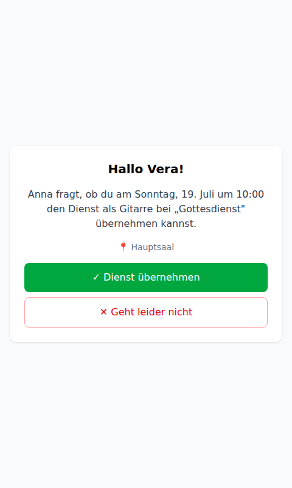
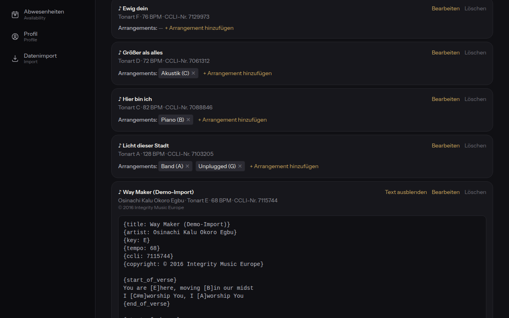
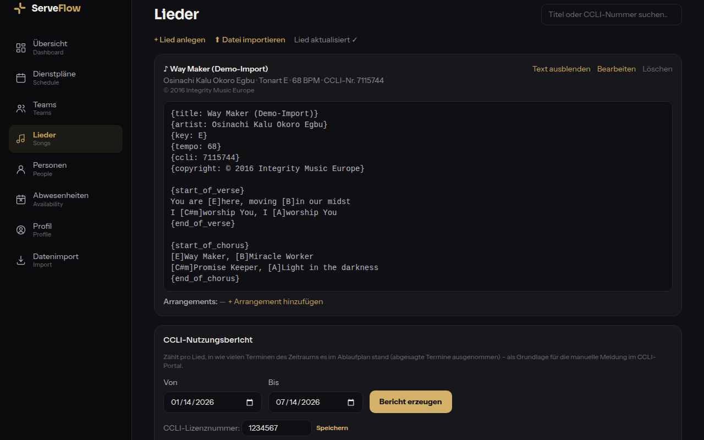

# ServeFlow – Anwenderhandbuch

Dieses Handbuch richtet sich an alle, die ServeFlow benutzen: Gemeindemitglieder,
Teamleitende und Administratorinnen/Administratoren. Technisches Vorwissen ist
nicht nötig.

**Inhalt**

1. [Anmelden](#1-anmelden)
2. [Übersicht: Meine Dienste](#2-übersicht-meine-dienste)
3. [Auf eine Einteilung antworten (Zusagen/Absagen)](#3-auf-eine-einteilung-antworten-zusagenabsagen)
4. [Dienstpläne ansehen](#4-dienstpläne-ansehen)
5. [Ablaufplan und Lieder](#5-ablaufplan-und-lieder)
6. [Abwesenheiten pflegen](#6-abwesenheiten-pflegen)
7. [Profil, Privatsphäre und Kalender-Abo](#7-profil-privatsphäre-und-kalender-abo)
8. [Für Teamleitende: Personen einteilen](#8-für-teamleitende-personen-einteilen)
9. [Für Teamleitende: Teams und Positionen](#9-für-teamleitende-teams-und-positionen)
10. [Für Admins: Benutzer anlegen und einladen](#10-für-admins-benutzer-anlegen-und-einladen)
11. [Für Admins: Datenimport aus Elvanto/Planning Center](#11-für-admins-datenimport-aus-elvantoplanning-center)
12. [Häufige Fragen](#12-häufige-fragen)

---

## 1. Anmelden

Öffne die ServeFlow-Adresse deiner Gemeinde im Browser (Handy oder Computer) und
melde dich mit deiner E-Mail-Adresse und deinem Passwort an.

**Passwort vergessen?** Über den Link unter dem Anmelde-Button forderst du
eine E-Mail mit einem Zurücksetz-Link an (1 Stunde gültig, einmal
verwendbar). Aus Sicherheitsgründen ist die Bestätigung immer gleich –
egal, ob die Adresse existiert. Admins können die Reset-Mail außerdem in
der Personenliste für jede Person anstoßen. Hinweis: Nach dem Zurücksetzen
werden alle angemeldeten Geräte abgemeldet.

- **Passwort vergessen?** Über den Link auf der Login-Seite bekommst du eine
  E-Mail mit einem Link, der 1 Stunde gültig ist.
- Falls für dein Konto die **Zwei-Faktor-Authentifizierung (2FA)** aktiviert ist,
  wirst du nach dem Passwort zusätzlich nach dem 6-stelligen Code aus deiner
  Authenticator-App gefragt.

> **Tipp:** Für das reine Zusagen/Absagen auf eine Einteilung brauchst du gar
> kein Login – der Link in der E-Mail genügt (siehe Kapitel 3).

## 2. Übersicht: Meine Dienste

Nach dem Anmelden siehst du die Übersicht mit **deinen anstehenden Diensten**.
Zu jedem Dienst kannst du direkt hier zusagen oder absagen.

Die farbigen Status bedeuten:

| Status           | Bedeutung                                               |
| ---------------- | ------------------------------------------------------- |
| 🟡 **angefragt** | Du wurdest eingeteilt, hast aber noch nicht geantwortet |
| 🟢 **zugesagt**  | Du hast den Dienst bestätigt                            |
| 🔴 **abgesagt**  | Du hast abgesagt – die Teamleitung wurde informiert     |

### Vertretung suchen (Dienst tauschen)

Du kannst einen Dienst doch nicht übernehmen? Statt nur abzusagen, kannst du
über **„⇄ Vertretung suchen"** selbst eine Vertretung anfragen: ServeFlow
zeigt dir alle geeigneten Personen (passende Position, am Termin verfügbar) –
du wählst eine aus, sie bekommt eine E-Mail mit einem Übernahme-Link:

- Sagt die Person zu, **wandert der Dienst automatisch auf sie über** – du
  bist ausgetragen, deine Teamleitung wird informiert. Lehnt sie ab, bekommst
  du eine E-Mail und kannst jemand anderen anfragen.
- Es läuft immer nur **eine Anfrage gleichzeitig**; solange sie offen ist,
  kannst du sie jederzeit zurückziehen.

### Offene Dienste – trag dich ein

Gibt es Dienste, die deine Teamleitung zur **Selbst-Eintragung** freigegeben
hat (z. B. Kaffee-Theke), erscheinen sie auf deiner Übersicht unter „Offene
Dienste". Ein Klick auf **„Eintragen"** genügt – das zählt direkt als Zusage,
deine Teamleitung wird informiert. Du siehst nur Dienste, für die du die
passende Position hast und an denen du nicht abwesend bist. Dasselbe geht
auch direkt im Termin: Bei freigegebenen Positionen steht dort der Button
**„Mich eintragen"**.

## 3. Auf eine Einteilung antworten (Zusagen/Absagen)

Wenn dich eine Teamleitung für einen Dienst einteilt, bekommst du eine E-Mail
mit zwei Links: **Zusagen** und **Absagen**. Ein Klick genügt – du musst dich
nicht anmelden.

- Bei einer **Absage** kannst du optional einen Grund angeben. Deine Teamleitung
  wird automatisch benachrichtigt und bekommt direkt Ersatz-Vorschläge.
- Der Link ist **nur einmal verwendbar** und läuft spätestens zum Termin ab.
  Willst du deine Antwort später ändern, geht das jederzeit eingeloggt unter
  „Meine Dienste".
- Vor dem Termin erinnert dich ServeFlow automatisch per E-Mail
  (standardmäßig 7 Tage und 1 Tag vorher).

## 4. Dienstpläne ansehen

Unter **Dienstpläne** siehst du alle kommenden Termine deiner Gemeinde mit dem
Besetzungsstand (z. B. „5/9 besetzt").

Ein Klick auf einen Termin öffnet den Plan: oben der **Ablauf** des
Gottesdienstes (siehe Kapitel 5), darunter die **Besetzung** – wer ist wofür
eingeteilt, und wer hat schon zu- oder abgesagt.

## 5. Ablaufplan und Lieder

Zu jedem Termin gibt es einen **Ablaufplan** (Order of Service): die
Programmpunkte des Gottesdienstes mit Uhrzeit, Dauer, Liedern und
Verantwortlichen. Alle können ihn sehen – so weiß die Technik, wann welches
Lied kommt, und die Moderation, wer nach der Predigt dran ist.

- Die **Uhrzeiten** berechnet ServeFlow automatisch aus der Startzeit des
  Termins und den Dauern der Punkte – änderst du eine Dauer, verschieben sich
  alle folgenden Zeiten mit. Oben steht die **Gesamtdauer**.
- Bei Liedern zeigt der Plan alles, was das Team braucht: **Titel, Arrangement,
  Tonart, Tempo und CCLI-Nummer** (z. B. für die Lizenz-Meldung).
- Über **„Drucken"** bekommst du eine aufgeräumte Druckansicht nur mit dem
  Ablauf – als Papier für Moderation/Technik oder als PDF (im Druckdialog
  „Als PDF speichern" wählen).

### Ablauf bearbeiten (Teamleitende und Admins)

Als Teamleitung oder Admin kannst du den Ablauf über **„Ablauf bearbeiten"**
direkt im Termin pflegen:

- **Programmpunkte** hinzufügen, umbenennen, löschen und mit den Pfeilen ↑/↓
  umsortieren; Dauer in Minuten je Punkt.
- Jedem Punkt kannst du ein **Lied** aus der Liederdatenbank zuordnen (inkl.
  Arrangement), eine **verantwortliche Person** und eine **Notiz** (z. B.
  „Übergang direkt ins Gebet").
- Fehlt ein Lied, legst du es mit **„+ Lied anlegen"** an, ohne den Editor zu
  verlassen.
- **Speichern** ersetzt den kompletten Ablauf – alle sehen sofort den neuen
  Stand.

### Die Liederdatenbank

Unter **Lieder** findest du alle Lieder deiner Gemeinde – durchsuchbar nach
Titel oder CCLI-Nummer:

- Pro Lied: **Standard-Tonart, Tempo (BPM), CCLI-Nummer, Autor(en),
  Copyright, Songtext** und beliebig viele **Arrangements** (z. B. „Akustik
  in C", „Band in A").
- Ansehen dürfen alle; anlegen und ändern können Teamleitende und Admins.
- Wird ein Lied gelöscht, bleiben alte Ablaufpläne erhalten – nur die
  Verknüpfung verschwindet.

#### Lieder aus SongSelect importieren

Eine direkte Verbindung zum CCLI-Konto ist leider nicht möglich – CCLI hat
sein Partner-API-Programm für neue Anbieter eingestellt. Der offizielle Weg
für SongSelect-Abonnenten: Lied bei SongSelect als **ChordPro-Datei** (oder
Nur-Text) **herunterladen** und hier über **Datei importieren** hochladen.

- Titel, Tonart, Tempo, CCLI-Nummer, Autoren, Copyright und der Songtext
  werden automatisch aus der Datei übernommen; über **Text anzeigen** siehst
  du den Songtext (inkl. Akkorden bei ChordPro).
- **Duplikate** werden über die CCLI-Nummer erkannt – beim erneuten Import
  fragt ServeFlow, ob das bestehende Lied überschrieben werden soll.
- Unterstützt werden ChordPro-Dateien (`.cho`, `.chopro`, `.pro`) und die
  Text-Downloads von SongSelect (`.txt`).
- Hinweis: Das Speichern von Songtexten setzt voraus, dass deine Gemeinde
  eine **CCLI-Lizenz** hat.

#### CCLI-Nutzungsbericht

Für die Meldung ans CCLI-Portal erzeugt ServeFlow auf der Lieder-Seite einen
**Nutzungsbericht**: pro Lied die Anzahl Termine im gewählten Zeitraum, in
deren Ablaufplan es stand (abgesagte Termine zählen nicht; dasselbe Lied
zweimal im selben Gottesdienst zählt einmal).

Den Bericht kannst du als **CSV herunterladen** und die Zahlen im CCLI-Portal
eintragen. Admins hinterlegen dort auch die **CCLI-Lizenznummer** der
Gemeinde. Eine automatische Meldung an CCLI gibt es (noch) nicht – auch das
scheitert derzeit am geschlossenen Partnerprogramm.

## 6. Abwesenheiten pflegen

Damit du nicht eingeteilt wirst, wenn du nicht kannst: Trage unter
**Abwesenheiten** deine Ferien und Blockzeiten ein.

- **Abwesenheiten:** Zeitraum von–bis, optional mit Grund. Der Grund ist nur
  für dich und Admins sichtbar.
- **Wiederkehrend nicht verfügbar:** z. B. „Jeden 1. Sonntag im Monat" – für
  regelmäßige Verpflichtungen.

Die Einteilungs-Vorschläge überspringen dich in diesen Zeiten automatisch, und
Teamleitende bekommen eine Warnung, falls sie dich trotzdem einteilen wollen.

## 7. Profil, Privatsphäre und Kalender-Abo

Unter **Profil** verwaltest du deine eigenen Daten:

- **Kontaktdaten:** E-Mail, Telefon, Adresse – alles außer deinem Namen ist
  freiwillig.
- **Sichtbarkeit meiner Daten:** Du bestimmst selbst, welche deiner
  Kontaktdaten Mitglieder deiner Teams sehen dürfen. Standardmäßig ist nichts
  freigegeben. Teamleitende deiner Teams sehen deine Kontaktdaten immer (sie
  brauchen sie für die Planung), Admins alles. Andere Mitglieder sehen nur
  deinen Namen und dein Foto.
- **Kalender-Abo (iCal):** Erzeuge eine persönliche Kalender-URL und füge sie
  in Google Calendar oder Apple Kalender als Abo hinzu – deine Dienste
  erscheinen dann automatisch in deinem Kalender. Die URL ist geheim; wenn du
  eine neue erzeugst, wird die alte ungültig.
- **Meine Daten:** Lade jederzeit alle über dich gespeicherten Daten als Datei
  herunter (Datenschutz-Auskunft).

Zum Profil kommst du auch über dein **Profilbild** in der Navigation: Ein
Klick öffnet ein kleines Menü mit „Mein Profil", „Passwort ändern" und
„Abmelden".

### Sicherheit: Passwort ändern & Zwei-Faktor-Authentisierung

Im Abschnitt **Sicherheit** des Profils kannst du:

- **Passwort ändern:** Gib dein aktuelles Passwort und zweimal das neue ein
  (mindestens 10 Zeichen). Aus Sicherheitsgründen werden dabei alle anderen
  angemeldeten Geräte abgemeldet – du selbst bleibst angemeldet.
- **Zwei-Faktor-Authentisierung (2FA) einrichten:** Nach dem Klick auf
  **„2FA einrichten"** führt dich ein Assistent in drei Schritten durch die
  Einrichtung:
  1. **QR-Code scannen** mit einer Authenticator-App (z. B. Aegis, Google
     Authenticator) – oder das angezeigte Secret manuell in der App eingeben.
  2. **Backup-Codes sichern:** Zehn Einmal-Codes für den Fall, dass du dein
     Gerät verlierst. Bewahre sie sicher auf (z. B. im Passwortmanager) – sie
     werden nur dieses eine Mal angezeigt.
  3. **Bestätigen:** Gib zum Abschluss einen Code aus der App ein – erst dann
     ist 2FA aktiv.

  Beim Anmelden wirst du künftig zusätzlich nach dem Code aus der App
  gefragt; alternativ funktioniert jeder Backup-Code genau einmal. Im Profil
  siehst du, wie viele Backup-Codes übrig sind, kannst **neue Codes
  erzeugen** (mit App-Code als Nachweis) oder 2FA **mit deinem Passwort
  deaktivieren**.

## 8. Für Teamleitende: Personen einteilen

Als Teamleitung öffnest du unter **Dienstpläne** einen Termin. Bei den
Positionen deiner Teams erscheint der Link **„+ Vorschläge"**:

So funktioniert die Einteilung:

1. **„Person eintragen" klicken.** Es öffnet sich eine Auswahlliste mit
   geeigneten Personen – sortiert nach **fairer Verteilung**: Wer lange nicht
   mehr dran war und zuletzt wenige Einsätze hatte, steht oben. Hinter jedem
   Namen steht warum (z. B. „zuletzt vor 49 Tagen · 1 Einsatz in 90 Tagen").
2. Personen, die **abwesend** oder am selben Termin schon eingeteilt sind,
   erscheinen gar nicht erst. Bei einem Dienst am Vor- oder Folgetag zeigt
   ServeFlow eine ⚠-Warnung, blockiert aber nicht.
3. **Person auswählen und „Einteilen" klicken.** Die Person bekommt sofort
   die E-Mail mit Zusagen/Absagen-Link; im Plan steht sie als „angefragt".
4. **Bei einer Absage** wirst du automatisch per E-Mail informiert – inklusive
   der drei besten Ersatz-Vorschläge, damit du schnell reagieren kannst.

Über **„Entfernen"** nimmst du eine Einteilung wieder heraus.

**Mich eintragen:** Hast du selbst die passende Position, steht neben
„Person eintragen" der Button **„Mich eintragen"** – ein Klick und du bist
direkt mit Zusage eingeteilt. Der Dienst erscheint sofort unter „Meine
Dienste" auf deiner Übersicht.

**Selbst-Eintragung freigeben:** Über den Link **„Für Selbst-Eintragung
freigeben"** öffnest du einen Slot für alle passenden Personen. Der Dienst
erscheint dann bei ihnen auf der Übersicht unter „Offene Dienste" (und im
Termin als „Mich eintragen"-Button), und sie können sich ohne dein Zutun
eintragen (zählt als Zusage, du wirst per E-Mail informiert). Praktisch für
Dienste ohne feste Planung wie Kaffee oder Aufbau. Mit **„Freigabe
aufheben"** schließt du den Slot wieder.

**Vertretungen:** Sucht sich eine eingeteilte Person selbst eine Vertretung
(siehe Kapitel 2), musst du nichts tun – die Einteilung wandert bei Zusage
automatisch, und du bekommst eine E-Mail über den Wechsel.

## 9. Für Teamleitende: Teams und Positionen

Unter **Teams** siehst du alle Teams mit ihren Positionen und Mitgliedern:

Als Teamleitung kannst du in **deinem eigenen Team**:

- Mitglieder aufnehmen und entfernen
- Positionen anlegen (z. B. Worship → Gitarre, Drums, Vocals)
- Mitgliedern Positionen mit **Skill-Level** zuordnen (Einsteiger / Solide /
  Profi) – nur so zugeordnete Personen können für die Position eingeteilt werden

### Rollen im Team & Rechtematrix

Jedes Mitglied hat im Team eine **Rolle**: **Leitung**, **Stellvertretung**,
**Mitarbeit** (Standard) oder **Praktikum**. Als Leitung wählst du die Rolle
direkt in der Mitgliederliste über das Auswahlfeld neben der Person.

Was die Rollen dürfen, legst du in der **Rechtematrix** deines Teams fest –
pro Rolle und Recht ein Häkchen (z. B. Einteilen, Dienste freigeben,
Positionen pflegen, Kontaktdaten sehen, Ablaufplan bearbeiten). Änderungen
gelten sofort. Voreingestellt ist die Stellvertretung eine „Leitung ohne
Personalhoheit" (alles außer Mitglieder & Rollen verwalten), Mitarbeit und
Praktikum starten ohne Verwaltungsrechte.

Die **Leitung** hat immer alle Rechte im Team – sie ist bewusst nicht
konfigurierbar, damit sich ein Team nicht selbst aussperren kann. Neue Teams
anlegen sowie die Rolle **Leitung** vergeben oder entziehen kann nur ein
Admin.

### Benutzer beantragen

Neue Personen anlegen können nur Admins – aber als Teamleitung musst du
niemandem hinterhertelefonieren: Unter **Personen** findest du das Formular
**Benutzer beantragen**.

Trage Name, E-Mail-Adresse und optional die Telefonnummer der Person ein
(leitest du mehrere Teams, wählst du zusätzlich das Team). Die Admins werden
per E-Mail informiert und entscheiden über den Antrag:

- **Genehmigt:** Die Person wird angelegt, **deinem Team als Mitarbeit
  hinzugefügt** und automatisch per E-Mail eingeladen (siehe Kapitel 10). Du
  bekommst eine Bestätigungs-Mail.
- **Abgelehnt:** Du bekommst eine Mail, ggf. mit Begründung.

Unter **Meine Anträge** siehst du jederzeit den Stand (offen / genehmigt /
abgelehnt) inklusive Kommentar der Admins.

## 10. Für Admins: Benutzer anlegen und einladen

Neue Mitarbeitende erfasst du als Admin direkt auf der Seite **Personen** über
**Person anlegen & einladen** – Vorname, Nachname, E-Mail und optional die
Telefonnummer genügen:

Die Person bekommt sofort eine **Einladungs-Mail** mit einem Link (7 Tage
gültig, einmal verwendbar). Über den Link wählt sie ihr Passwort – erst damit
entsteht ihr Login-Konto:

Gut zu wissen:

- **Personen ohne Konto** (z. B. aus einem Datenimport) zeigen in der
  Personenliste den Button **Einladen** – so holst du bestehende Personen
  nachträglich ins Tool. **Erneut einladen** ist jederzeit möglich; der alte
  Link wird dabei ungültig.
- Bei Personen **mit Konto** steht an derselben Stelle der Button für die
  **Passwort-Reset-Mail** (falls sich jemand ausgesperrt hat).
- Bis zur Einrichtung des Kontos ist die Person ganz normal planbar – das
  Konto ist nur der Login.

### Benutzer-Anträge prüfen

Beantragt eine Teamleitung einen neuen Benutzer, bekommst du eine E-Mail, und
auf der Seite **Personen** erscheint der Abschnitt **Offene Benutzer-Anträge**:

Mit **Genehmigen** wird die Person angelegt, dem Team der antragstellenden
Leitung als Mitarbeit hinzugefügt und automatisch eingeladen. Mit **Ablehnen**
passiert nichts weiter – in beiden Fällen kannst du einen Kommentar mitgeben,
den die Teamleitung per Mail erhält.

## 11. Für Admins: Datenimport aus Elvanto/Planning Center

Für den Umstieg von Elvanto oder Planning Center gibt es den Import-Assistenten
unter **Datenimport** (nur für Admins sichtbar). Nichts wird ohne Vorschau
geschrieben.

**Schritt 1 – Datei hochladen:** Quelle wählen (Elvanto oder Planning Center)
und den offiziellen CSV-Export auswählen. ServeFlow erkennt die Spalten
automatisch; du kannst jede Zuordnung anpassen:

**Schritt 2 – Vorschau (Dry-Run):** ServeFlow zeigt, was passieren _würde_ –
neu angelegt, mit bestehenden Personen zusammengeführt, übersprungen oder
fehlerhaft. Die Datenbank bleibt dabei unverändert:

**Schritt 3 – Import ausführen:** Erst mit diesem Klick wird geschrieben.
Wichtig zu wissen:

- **Duplikate** werden über die E-Mail-Adresse erkannt (Ersatzweise über
  Name + Geburtsdatum). Bereits gepflegte Daten werden **nie überschrieben** –
  der Import füllt nur leere Felder auf.
- **Teams** aus der Spalte „Teams/Groups" werden automatisch angelegt und die
  Personen zugeordnet.
- **Fehlerhafte Zeilen** brechen den Import nicht ab – sie landen in einem
  herunterladbaren Fehlerreport (CSV), den du nacharbeiten kannst.
- Spalten, die es in ServeFlow nicht gibt, gehen nicht verloren – sie werden
  in den Import-Notizen der Person gespeichert.

Weitere Admin-Themen (Erst-Einrichtung, Betrieb, Backups) sind in der
[technischen Dokumentation](../README.md) beschrieben.

## 12. Häufige Fragen

**Ich habe die Einteilungs-Mail gelöscht – wie antworte ich jetzt?**
Melde dich an; unter „Meine Dienste" kannst du jederzeit zu- oder absagen.

**Ich kann doch nicht – muss ich einfach absagen?**
Besser: Nutze **„Vertretung suchen"** unter „Meine Dienste". Du fragst damit
selbst eine geeignete Person an; sagt sie zu, übernimmt sie deinen Dienst
automatisch (siehe Kapitel 2).

**Mein Zusage-Link funktioniert nicht mehr.**
Jeder Link ist nur einmal verwendbar und läuft spätestens zum Termin ab.
Antworte eingeloggt unter „Meine Dienste" oder melde dich bei deiner Teamleitung.

**Warum sehe ich von anderen Personen keine Telefonnummer?**
Aus Datenschutzgründen sehen Mitglieder nur Name und Foto. Jede Person gibt in
ihrem Profil selbst frei, was ihre Teammitglieder zusätzlich sehen dürfen.

**Ich werde nie vorgeschlagen – woran liegt das?**
Vermutlich fehlt dir die Positions-Zuordnung. Bitte deine Teamleitung, dir die
Position (z. B. „Gitarre") mit Skill-Level zuzuweisen.

**Wie lösche ich mein Konto?**
Wende dich an eine Administratorin/einen Administrator. Deine Daten werden auf
Wunsch vollständig gelöscht oder anonymisiert (dann bleiben alte Dienstpläne
lesbar, aber ohne deinen Namen).
