# ServeFlow – Anwenderhandbuch

Dieses Handbuch richtet sich an alle, die ServeFlow benutzen: Gemeindemitglieder,
Teamleitende und Administratorinnen/Administratoren. Technisches Vorwissen ist
nicht nötig.

**Inhalt**

1. [Anmelden](#1-anmelden)
2. [Übersicht: Meine Dienste](#2-übersicht-meine-dienste)
3. [Auf eine Einteilung antworten (Zusagen/Absagen)](#3-auf-eine-einteilung-antworten-zusagenabsagen)
4. [Dienstpläne ansehen](#4-dienstpläne-ansehen)
5. [Ablaufplan und Lieder](#5-ablaufplan-und-lieder)
6. [Abwesenheiten pflegen](#6-abwesenheiten-pflegen)
7. [Profil, Privatsphäre und Kalender-Abo](#7-profil-privatsphäre-und-kalender-abo)
8. [Für Teamleitende: Personen einteilen](#8-für-teamleitende-personen-einteilen)
9. [Für Teamleitende: Teams und Positionen](#9-für-teamleitende-teams-und-positionen)
10. [Für Admins: Datenimport aus Elvanto/Planning Center](#10-für-admins-datenimport-aus-elvantoplanning-center)
11. [Häufige Fragen](#11-häufige-fragen)

---

## 1. Anmelden

Öffne die ServeFlow-Adresse deiner Gemeinde im Browser (Handy oder Computer) und
melde dich mit deiner E-Mail-Adresse und deinem Passwort an.

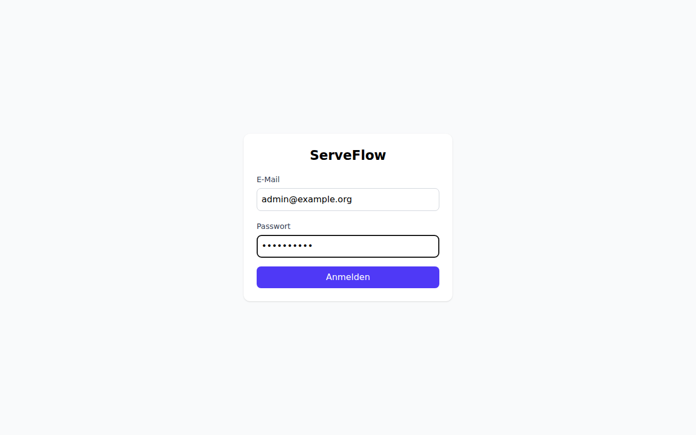

- **Passwort vergessen?** Über den Link auf der Login-Seite bekommst du eine
  E-Mail mit einem Link, der 1 Stunde gültig ist.
- Falls für dein Konto die **Zwei-Faktor-Authentifizierung (2FA)** aktiviert ist,
  wirst du nach dem Passwort zusätzlich nach dem 6-stelligen Code aus deiner
  Authenticator-App gefragt.

> **Tipp:** Für das reine Zusagen/Absagen auf eine Einteilung brauchst du gar
> kein Login – der Link in der E-Mail genügt (siehe Kapitel 3).

## 2. Übersicht: Meine Dienste

Nach dem Anmelden siehst du die Übersicht mit **deinen anstehenden Diensten**.
Zu jedem Dienst kannst du direkt hier zusagen oder absagen.

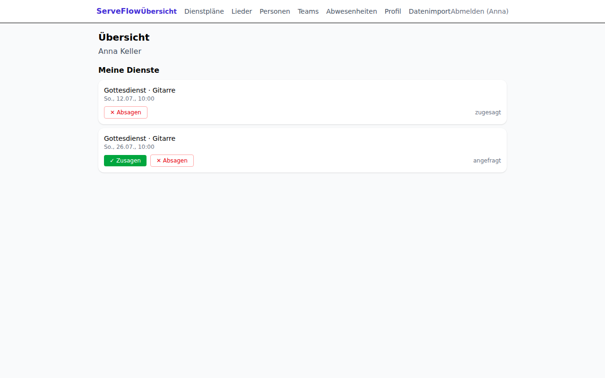

Die farbigen Status bedeuten:

| Status           | Bedeutung                                               |
| ---------------- | ------------------------------------------------------- |
| 🟡 **angefragt** | Du wurdest eingeteilt, hast aber noch nicht geantwortet |
| 🟢 **zugesagt**  | Du hast den Dienst bestätigt                            |
| 🔴 **abgesagt**  | Du hast abgesagt – die Teamleitung wurde informiert     |

## 3. Auf eine Einteilung antworten (Zusagen/Absagen)

Wenn dich eine Teamleitung für einen Dienst einteilt, bekommst du eine E-Mail
mit zwei Links: **Zusagen** und **Absagen**. Ein Klick genügt – du musst dich
nicht anmelden.

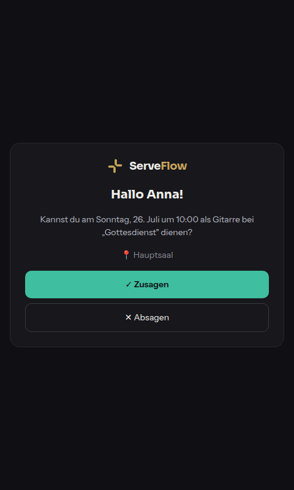

- Bei einer **Absage** kannst du optional einen Grund angeben. Deine Teamleitung
  wird automatisch benachrichtigt und bekommt direkt Ersatz-Vorschläge.
- Der Link ist **nur einmal verwendbar** und läuft spätestens zum Termin ab.
  Willst du deine Antwort später ändern, geht das jederzeit eingeloggt unter
  „Meine Dienste".
- Vor dem Termin erinnert dich ServeFlow automatisch per E-Mail
  (standardmäßig 7 Tage und 1 Tag vorher).

## 4. Dienstpläne ansehen

Unter **Dienstpläne** siehst du alle kommenden Termine deiner Gemeinde mit dem
Besetzungsstand (z. B. „5/9 besetzt").

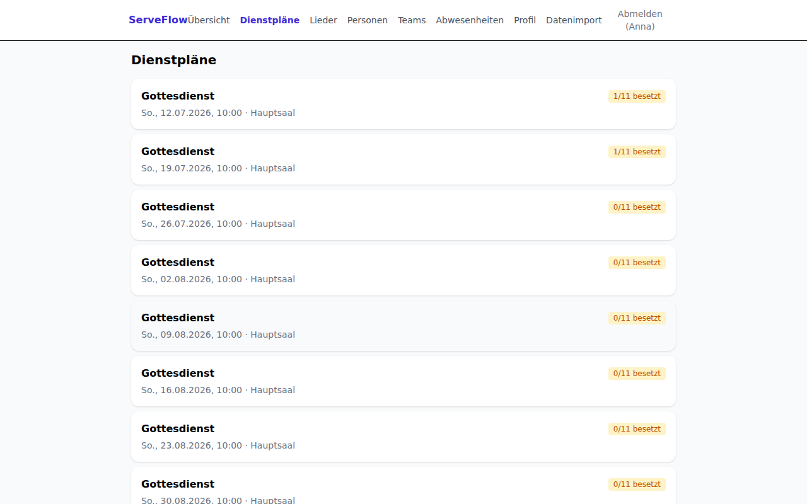

Ein Klick auf einen Termin öffnet den Plan: oben der **Ablauf** des
Gottesdienstes (siehe Kapitel 5), darunter die **Besetzung** – wer ist wofür
eingeteilt, und wer hat schon zu- oder abgesagt.

## 5. Ablaufplan und Lieder

Zu jedem Termin gibt es einen **Ablaufplan** (Order of Service): die
Programmpunkte des Gottesdienstes mit Uhrzeit, Dauer, Liedern und
Verantwortlichen. Alle können ihn sehen – so weiß die Technik, wann welches
Lied kommt, und die Moderation, wer nach der Predigt dran ist.

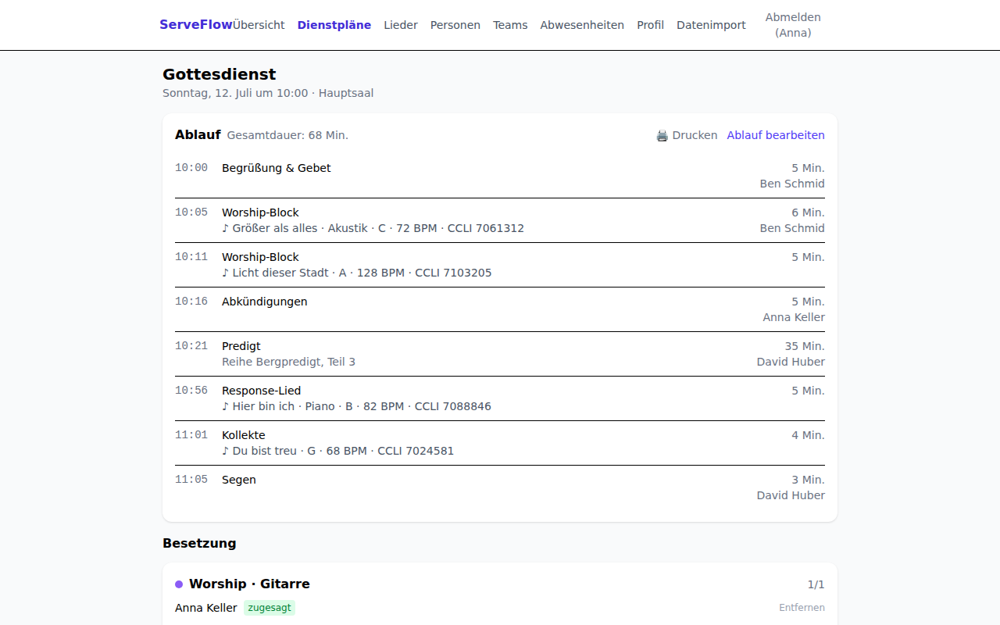

- Die **Uhrzeiten** berechnet ServeFlow automatisch aus der Startzeit des
  Termins und den Dauern der Punkte – änderst du eine Dauer, verschieben sich
  alle folgenden Zeiten mit. Oben steht die **Gesamtdauer**.
- Bei Liedern zeigt der Plan alles, was das Team braucht: **Titel, Arrangement,
  Tonart, Tempo und CCLI-Nummer** (z. B. für die Lizenz-Meldung).
- Über **„Drucken"** bekommst du eine aufgeräumte Druckansicht nur mit dem
  Ablauf – als Papier für Moderation/Technik oder als PDF (im Druckdialog
  „Als PDF speichern" wählen).

### Ablauf bearbeiten (Teamleitende und Admins)

Als Teamleitung oder Admin kannst du den Ablauf über **„Ablauf bearbeiten"**
direkt im Termin pflegen:

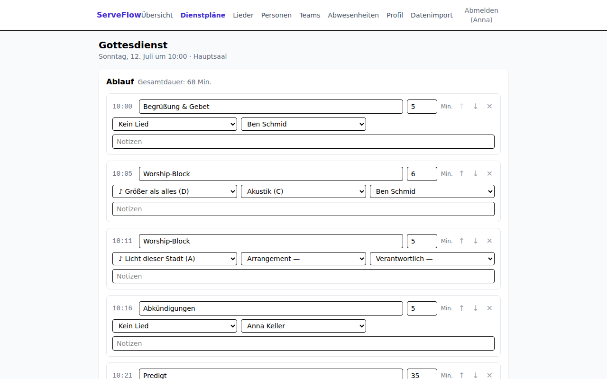

- **Programmpunkte** hinzufügen, umbenennen, löschen und mit den Pfeilen ↑/↓
  umsortieren; Dauer in Minuten je Punkt.
- Jedem Punkt kannst du ein **Lied** aus der Liederdatenbank zuordnen (inkl.
  Arrangement), eine **verantwortliche Person** und eine **Notiz** (z. B.
  „Übergang direkt ins Gebet").
- Fehlt ein Lied, legst du es mit **„+ Lied anlegen"** an, ohne den Editor zu
  verlassen.
- **Speichern** ersetzt den kompletten Ablauf – alle sehen sofort den neuen
  Stand.

### Die Liederdatenbank

Unter **Lieder** findest du alle Lieder deiner Gemeinde – durchsuchbar nach
Titel oder CCLI-Nummer:

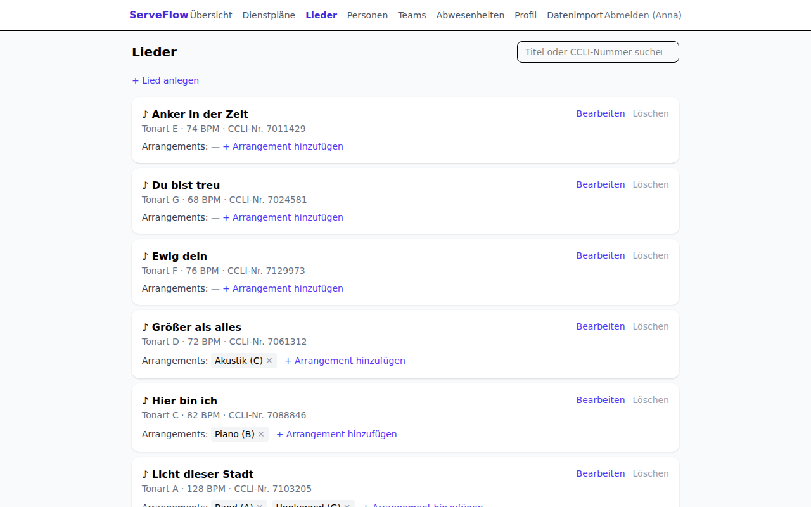

- Pro Lied: **Standard-Tonart, Tempo (BPM), CCLI-Nummer** und beliebig viele
  **Arrangements** (z. B. „Akustik in C", „Band in A").
- Ansehen dürfen alle; anlegen und ändern können Teamleitende und Admins.
- Wird ein Lied gelöscht, bleiben alte Ablaufpläne erhalten – nur die
  Verknüpfung verschwindet.

## 6. Abwesenheiten pflegen

Damit du nicht eingeteilt wirst, wenn du nicht kannst: Trage unter
**Abwesenheiten** deine Ferien und Blockzeiten ein.

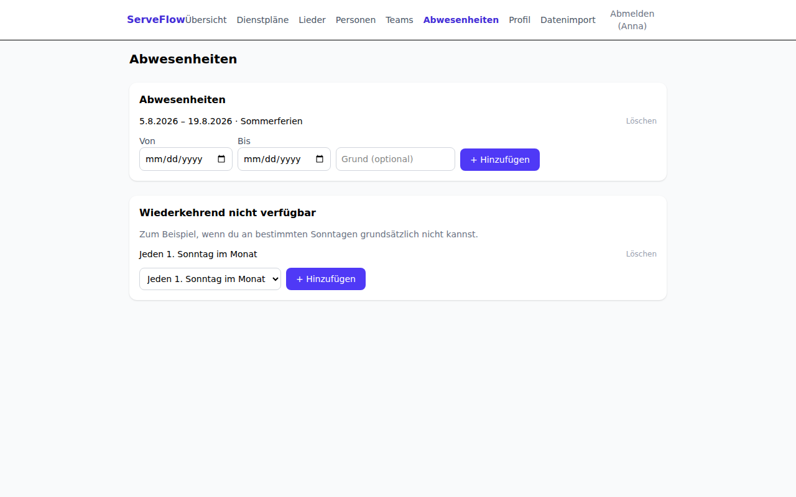

- **Abwesenheiten:** Zeitraum von–bis, optional mit Grund. Der Grund ist nur
  für dich und Admins sichtbar.
- **Wiederkehrend nicht verfügbar:** z. B. „Jeden 1. Sonntag im Monat" – für
  regelmäßige Verpflichtungen.

Die Einteilungs-Vorschläge überspringen dich in diesen Zeiten automatisch, und
Teamleitende bekommen eine Warnung, falls sie dich trotzdem einteilen wollen.

## 7. Profil, Privatsphäre und Kalender-Abo

Unter **Profil** verwaltest du deine eigenen Daten:

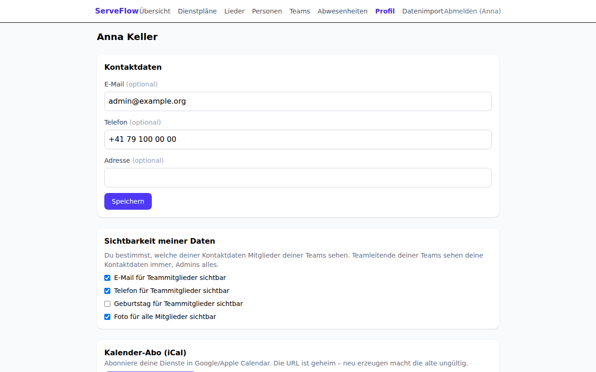

- **Kontaktdaten:** E-Mail, Telefon, Adresse – alles außer deinem Namen ist
  freiwillig.
- **Sichtbarkeit meiner Daten:** Du bestimmst selbst, welche deiner
  Kontaktdaten Mitglieder deiner Teams sehen dürfen. Standardmäßig ist nichts
  freigegeben. Teamleitende deiner Teams sehen deine Kontaktdaten immer (sie
  brauchen sie für die Planung), Admins alles. Andere Mitglieder sehen nur
  deinen Namen und dein Foto.
- **Kalender-Abo (iCal):** Erzeuge eine persönliche Kalender-URL und füge sie
  in Google Calendar oder Apple Kalender als Abo hinzu – deine Dienste
  erscheinen dann automatisch in deinem Kalender. Die URL ist geheim; wenn du
  eine neue erzeugst, wird die alte ungültig.
- **Meine Daten:** Lade jederzeit alle über dich gespeicherten Daten als Datei
  herunter (Datenschutz-Auskunft).

## 8. Für Teamleitende: Personen einteilen

Als Teamleitung öffnest du unter **Dienstpläne** einen Termin. Bei den
Positionen deiner Teams erscheint der Link **„+ Vorschläge"**:

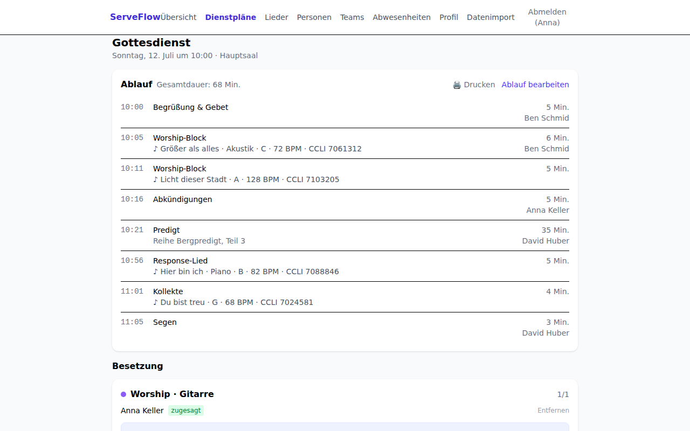

So funktioniert die Einteilung:

1. **„+ Vorschläge" klicken.** ServeFlow schlägt geeignete Personen vor –
   sortiert nach **fairer Verteilung**: Wer lange nicht mehr dran war und
   zuletzt wenige Einsätze hatte, steht oben. Unter jedem Namen steht warum
   (z. B. „zuletzt vor 49 Tagen · 1 Einsatz in 90 Tagen").
2. Personen, die **abwesend** oder am selben Termin schon eingeteilt sind,
   erscheinen gar nicht erst. Bei einem Dienst am Vor- oder Folgetag zeigt
   ServeFlow eine ⚠-Warnung, blockiert aber nicht.
3. **„Einteilen" klicken.** Die Person bekommt sofort die E-Mail mit
   Zusagen/Absagen-Link; im Plan steht sie als „angefragt".
4. **Bei einer Absage** wirst du automatisch per E-Mail informiert – inklusive
   der drei besten Ersatz-Vorschläge, damit du schnell reagieren kannst.

Über **„Entfernen"** nimmst du eine Einteilung wieder heraus.

## 9. Für Teamleitende: Teams und Positionen

Unter **Teams** siehst du alle Teams mit ihren Positionen und Mitgliedern:

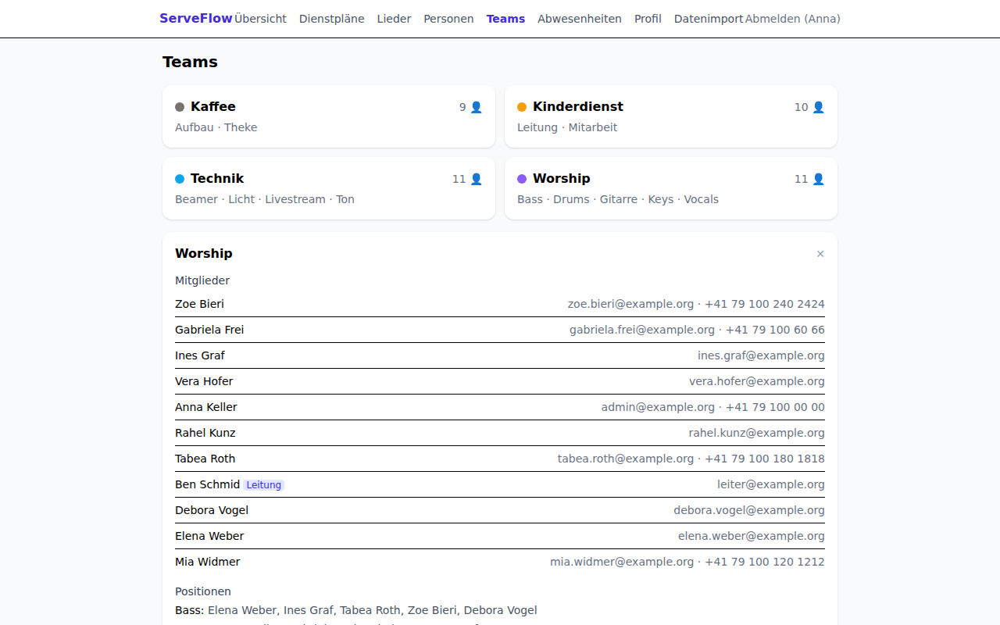

Als Teamleitung kannst du in **deinem eigenen Team**:

- Mitglieder aufnehmen und entfernen
- Positionen anlegen (z. B. Worship → Gitarre, Drums, Vocals)
- Mitgliedern Positionen mit **Skill-Level** zuordnen (Einsteiger / Solide /
  Profi) – nur so zugeordnete Personen können für die Position eingeteilt werden

Neue Teams anlegen und das Teamleiter-Recht vergeben kann nur ein Admin.

## 10. Für Admins: Datenimport aus Elvanto/Planning Center

Für den Umstieg von Elvanto oder Planning Center gibt es den Import-Assistenten
unter **Datenimport** (nur für Admins sichtbar). Nichts wird ohne Vorschau
geschrieben.

**Schritt 1 – Datei hochladen:** Quelle wählen (Elvanto oder Planning Center)
und den offiziellen CSV-Export auswählen. ServeFlow erkennt die Spalten
automatisch; du kannst jede Zuordnung anpassen:

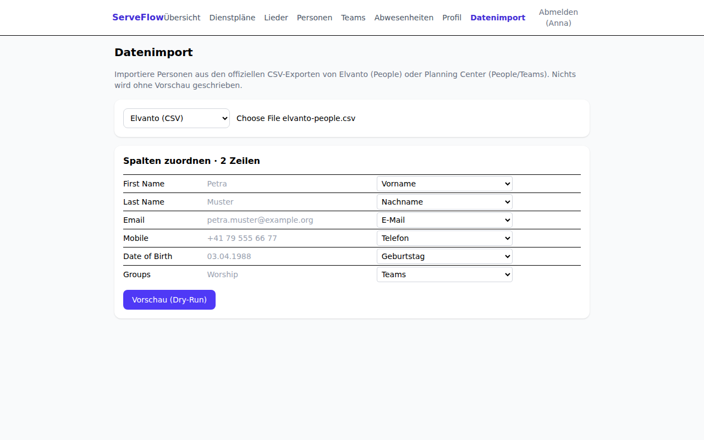

**Schritt 2 – Vorschau (Dry-Run):** ServeFlow zeigt, was passieren _würde_ –
neu angelegt, mit bestehenden Personen zusammengeführt, übersprungen oder
fehlerhaft. Die Datenbank bleibt dabei unverändert:

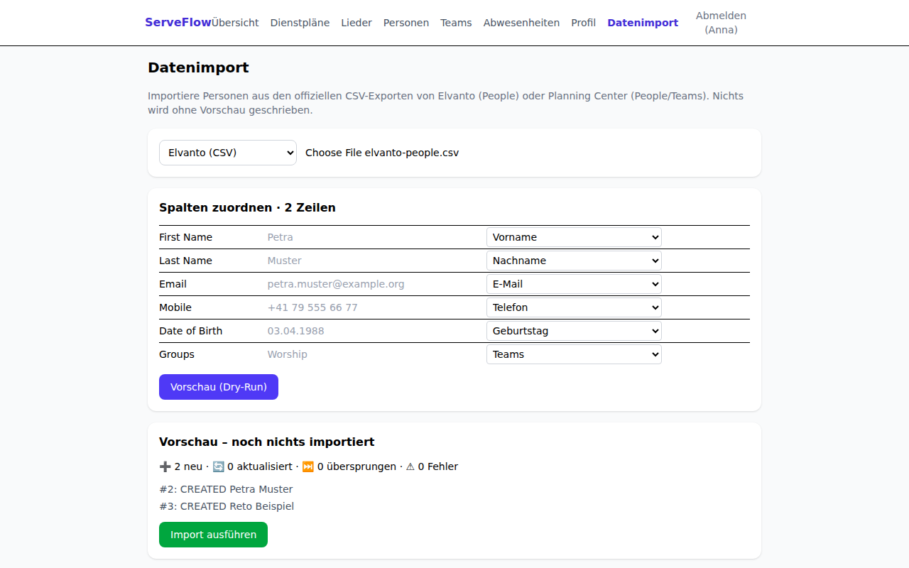

**Schritt 3 – Import ausführen:** Erst mit diesem Klick wird geschrieben.
Wichtig zu wissen:

- **Duplikate** werden über die E-Mail-Adresse erkannt (Ersatzweise über
  Name + Geburtsdatum). Bereits gepflegte Daten werden **nie überschrieben** –
  der Import füllt nur leere Felder auf.
- **Teams** aus der Spalte „Teams/Groups" werden automatisch angelegt und die
  Personen zugeordnet.
- **Fehlerhafte Zeilen** brechen den Import nicht ab – sie landen in einem
  herunterladbaren Fehlerreport (CSV), den du nacharbeiten kannst.
- Spalten, die es in ServeFlow nicht gibt, gehen nicht verloren – sie werden
  in den Import-Notizen der Person gespeichert.

Weitere Admin-Themen (Erst-Einrichtung, Betrieb, Backups) sind in der
[technischen Dokumentation](../README.md) beschrieben.

## 11. Häufige Fragen

**Ich habe die Einteilungs-Mail gelöscht – wie antworte ich jetzt?**
Melde dich an; unter „Meine Dienste" kannst du jederzeit zu- oder absagen.

**Mein Zusage-Link funktioniert nicht mehr.**
Jeder Link ist nur einmal verwendbar und läuft spätestens zum Termin ab.
Antworte eingeloggt unter „Meine Dienste" oder melde dich bei deiner Teamleitung.

**Warum sehe ich von anderen Personen keine Telefonnummer?**
Aus Datenschutzgründen sehen Mitglieder nur Name und Foto. Jede Person gibt in
ihrem Profil selbst frei, was ihre Teammitglieder zusätzlich sehen dürfen.

**Ich werde nie vorgeschlagen – woran liegt das?**
Vermutlich fehlt dir die Positions-Zuordnung. Bitte deine Teamleitung, dir die
Position (z. B. „Gitarre") mit Skill-Level zuzuweisen.

**Wie lösche ich mein Konto?**
Wende dich an eine Administratorin/einen Administrator. Deine Daten werden auf
Wunsch vollständig gelöscht oder anonymisiert (dann bleiben alte Dienstpläne
lesbar, aber ohne deinen Namen).
